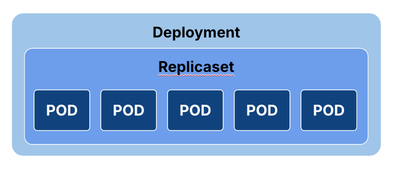
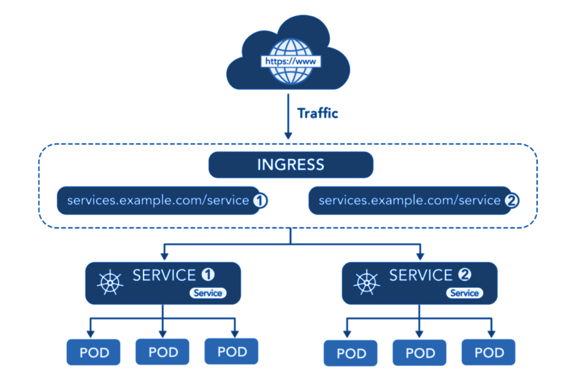

# Kubernetes Administration
---

## Understand KubeConfig File

`Kubeconfig` file is a YAML file that contains all the cluster information and credentials to connect to the cluster

It has either a secure token or a combination of username and password or certificates to authenticate the Kubernetes cluster

The default location of the kubeconfig file is `~/.kube/config` which you can also verify by checking the value of the `KUBECONFIG` environment variable

Example :
```yaml
apiVersion: v1
kind: Config
preferences: {}
current-context: minikube

clusters:
- cluster:
    certificate-authority: C:\Users\ariya\.minikube\ca.crt
    extensions:
    - extension:
        last-update: Thu, 13 Oct 2024 20:28:55 +07
        provider: minikube.sigs.k8s.io
        version: v1.33.0
      name: cluster_info
    server: https://127.0.0.1:56349
  name: minikube

contexts:
- context:
    cluster: minikube
    extensions:
    - extension:
        last-update: Thu, 17 Oct 2024 20:28:55 +07
        provider: minikube.sigs.k8s.io
        version: v1.33.0
      name: context_info
    namespace: default
    user: minikube
  name: minikube

users:
- name: minikube
  user:
    client-certificate: C:\Users\ariya\.minikube\profiles\minikube\client.crt
    client-key: C:\Users\ariya\.minikube\profiles\minikube\client.key
```

- **To list out all the contexts in the kuberentes cluster**
    ```shell
    kubectl config get-contexts
    ```
    It will show the list of cluster contexts and the last column will be the namespace.
- **To get the current context in the kuberentes cluster**
    ```shell
    kubectl config current-context
    ```
    The `*` shows that you are currently in that context. Here we can see the current context is developer.

- **To change the current context in the kuberentes cluster**
    ```shell
    kubectl config use-context production
    ```
    Suppose you want to change the current context  to `production`. We can quickly switch between clusters by using the kubectl config use-context command

---
## Kubernetes Deployment

Deployments are designed for stateless applications where any pod can replace another without issues. They handle scaling and rolling updates. Deployments are used directly by Kubernetes users to manage and scale applications on the cluster.

### Replicaset
Replicaset is a Kubernetes object that ensures there is always a stable set of running pods for a specific workload. The Replicaset configuration defines a number of identical pods required, and if a pod is evicted or fails, creates more pods to compensate for the loss.

#### Create First Replicaset

```yaml
# nginx-replicaset.yaml

apiVersion: apps/v1
kind: Replicaset
metadata:
  name: web
  labels:
    env: dev
    role: web
spec:
  replicas: 4
  selector:
    matchLabels:
      role: web
  template:
    metadata:
      labels:
        role: web
    spec:
      containers:
      - name: testnginx
        image: nginx
```
- **To apply manifest file**
    ```shell
    kubectl apply -f nginx-replicaset.yaml
    ```
- **To get status of replicaset**
    ```shell
    kubectl get replicaset
    ```

Lets examine the manifest file that was used to create our Replicaset :
- The apiVersion for the object is `app/v1`
- The kind of this object is `ReplicaSet`
- In the metadata part, we define the name by which we can refer to this Replicaset. We also define a number of labels through which we can identify it.
- The spec part is mandatory in the Replicaset object. It defines:
	- The number of replicas this controller should maintain. It default to 1 if it was not specified.
	- The selection criteria by which the Replicaset will choose its pods. Be careful not to use a label that is already in use by another controller. Otherwise, another Replicaset may acquire the pods first. Also notice that the labels defined in the pod template `(spec.template.metadata.label) `cannot be different than those defined in the matchLabels part `(spec.selector)`.
	- The pod template is used to create or recreate new pods. It has its own metadata, and spec where the containers are specified.

#### Removing a pod From a Replicaset
We can remove (not delete) a pod that is managed by a Replicaset by simply changing some label.

Example : 
```shell
kubectl edit web-5hnwc
```
Then, once the yaml file is opened, change the pod label to be role=isolated or anything different than role=web. In a few moments, run `kubectl get pods`.

#### Delete replicaset
To delete the replicaset, simply we just run :
```shell
kubectl delete rs <replicaset-name>
```

Alternatively, you can also use the file that was used to create the resource to delete all the resources defined in the file like this :
```shell
kubectl delete -f <manifest-file>
```

### Deployment
We looked at Replicasets earlier. However, Replicaset have one major drawback: once you select the pods that are managed by a Replicaset, you cannot change their pod templates.

For example, if you are using a Replicaset to deploy four pods with NodeJS running and you want to change the NodeJS image to a newer version, you need to delete the Replicaset and recreate it. Restarting the pods causes downtime till the images are available and the pods are running again.

A Deployment resource uses a Replicaset to manage the pods. However, it handles updating them in a controlled way. Lets dig deeper into Deployment Controllers and patterns.

#### Create First Deploymnet
```yaml
# nginx-deployment.yaml

apiVersion: apps/v1
kind: Deployment
metadata:
  name: nginx-deployment
spec:
  selector:
    matchLabels:
      app: nginx
  replicas: 2
  template:
    metadata:
      labels:
        app: nginx
    spec:
      containers:
      - name: nginx
        image: nginx:stable-perl
        ports:
        - containerPort: 80
```
- **To apply manifest file**
    ```shell
    kubectl apply -f nginx-deployment.yaml
    ```
- **To get status of deployment**
    ```shell
    kubectl get deployment
    ```
- **To get detailed information from a deployment**
    ```shell
    kubectl describe <deployment-name>
    ```

#### Scale Up/Down Deployment
Its very common to see that applications get overloaded during peak hours. One of the easiest ways to handle such scenarios is to deploy the additional instances of the applications.

##### Using Manifest File
In the yaml file, weve set the value of `spec.replicas` to 2. This property controls the number of pods to be created.

```yaml
# nginx-deployment.yaml

apiVersion: apps/v1
kind: Deployment
metadata:
  name: nginx-deployment
spec:
  selector:
    matchLabels:
      app: nginx
  replicas: 4  # <--- Update this value
  template:
    metadata:
      labels:
        app: nginx
    spec:
      containers:
      - name: nginx
        image: nginx:stable-perl
        ports:
        - containerPort: 80
```

##### Using The Scale Command
We can also use the scale command to scale pods. The sole purpose of this command is to set a new size for a deployment, replica set, replication controller, or stateful set.

```shell
kubectl scale deployments/nginx-deployment --replicas=4
```

#### Perform Rolling Updates
So far, everything in our deployment did is no different than a typical replicaset. The real power of a deployment lies in its ability to update the pod templates without causing application outage.

Lets say that you have finished testing the nginx 1.7.9 , and you are ready to use it in production. The current pods are using the older nginx version.
To update the image of the application to new version, use the set image command :
```shell
kubectl set image  deployments/nginx-deployment nginx=nginx:1.9.1
```

- **To confirm the update by running the rollout status subcommand**
    ```shell
    kubectl rollout status deploy/nginx-deployment
    ```
    Expected response :
    ```shell
    Waiting for deployment "nginx-deployment" rollout to finish: 3 out of 4 new replicas have been updated...
    Waiting for deployment "nginx-deployment" rollout to finish: 3 out of 4 new replicas have been updated...
    Waiting for deployment "nginx-deployment" rollout to finish: 3 out of 4 new replicas have been updated...
    Waiting for deployment "nginx-deployment" rollout to finish: 3 out of 4 new replicas have been updated...
    Waiting for deployment "nginx-deployment" rollout to finish: 1 old replicas are pending termination...
    Waiting for deployment "nginx-deployment" rollout to finish: 1 old replicas are pending termination...
    Waiting for deployment "nginx-deployment" rollout to finish: 1 old replicas are pending termination...
    Waiting for deployment "nginx-deployment" rollout to finish: 3 of 4 updated replicas are available...
    deployment "nginx-deployment" successfully rolled out
    ```

### Pod



What are Kubernetes pods?
- Kubernetes pods are the smallest unit for all higher Kubernetes objects.
- A pod hosts one or more containers.
- It can be created using either a command or a YAML/JSON file.
- Use kubectl to create pods, view the running ones, modify their configuration, or terminate them. Kuberbetes will attempt to restart a failing pod by default.
- If the pod fails to start indefinitely, we can use the kubectl describe command to know what went wrong.

**Why does Kubernetes use a pod as the smallest deployable unit, and not a single container ?**
While it would seem simpler to just deploy a single container directly, there are good reasons to add a layer of abstraction represented by the Pod. A container is an existing entity, which refers to a specific thing.

To manage a container, Kubernetes needs additional information, such as a restart policy, which defines what to do with a container when it terminates, or a liveness probe, which defines an action to detect if a process in a container is still alive from the applications perspective, such as a web server responding to HTTP requests.

**What the difference between single container and multi-container pods ?**
Running a single container in a pod is a common use case. Here, the pod acts as a wrapper around the single container and Kubernetes manages the pods rather than the containers directly.

We can also run multiple containers in a pod. Here, the pod wraps around an application that composed of multiple containers and share resources.

If we need to run multiple containers within a single pod, it recommended that we only do this in cases where the containers are tightly coupled.

#### Create Pod

We can define Pods in Kubernetes using YAML files. Using these YAML files, we can create objects that interact with the Kubernetes API (Pods, Namespace, Deployments etc.). Under the hood, kubectl converts the information that we have defined in our YAML file to JSON, that makes the request to the Kubernetes API.

Example : 
```yaml
# nginx-pod.yaml

apiVersion: v1
kind: Pod
metadata:
  name: nginx-single
  labels:
    name: nginx-single
spec:
  containers:
  - name: nginx
    image: nginx
```
- **To create using kubectl**
  ```shell
  kubectl apply -f nginx-pod.yaml
  ```
- **To verify pod status**
  ```shell
  kubectl get pods
  ```
- **To get detail of pod**
  ```shell
  kubectl get pods -owide
  ```
- **To get more detail of pod**
  ```shell
  kubectl describe pod nginx-single
  ```
- **To expose a container port externally**
  ```shell
  kubectl port-forward nginx-single 8080:80
  ```
- **To executing command agains pod**
  ```shell
  kubectl exec -it nginx-single -- /bin/bash
  ```
- **Get logs of pod**
  ```shell
  kubectl logs nginx-single
  ```

#### Add a 2nd Container to Pod
In the microservices architecture, each module should live in its own space and communicate with other modules following a set of rules. But, sometimes we need to deviate a little from this principle. Suppose you have an Nginx web server running and we need to analyze its web logs in real time.

For example, the developers created a log watcher application that will do this job and they built a container for it. So, we need to eliminate any network latency so that the watcher can analyze logs the moment they are available. A solution for this is to place both containers on the same pod.

Having both containers on the same pod allows them to communicate through the loopback interface (ifconfig lo) as if they were two processes running on the same host. They also share the same storage volume.

Example :
```yaml
# nginx-pod-2.yaml

apiVersion: v1
kind: Pod
metadata:
  name: nginx-multiple
spec:
  containers:
  - name: nginx
    image: nginx
    ports:
    - containerPort: 80
  - name: webwatcher
    image: afakharany/watcher:latest
```
- **To create using kubectl**
  ```shell
  kubectl apply -f nginx-pod-2.yaml
  ```
- **To verify pod status**
  ```shell
  kubectl get po -o wide
  ```
- **To verify each pod was running**
  ```shell
  kubectl describe pods nginx-multiple
  ```
- **To executing command agains pod**
  ```shell
  kubectl exec -it nginx-multiple -c webwatcher -- /bin/bash
  ```

#### Shared volumes in a Kubernetes Pod
In Kubernetes, we can use a shared Kubernetes Volume as a simple and efficient way to share data between containers in a Pod. For most cases, it is sufficient to use a directory on the host that is shared with all containers within a Pod.

A standard use case for a multi-container Pod with a shared Volume is when one container writes logs or other files to the shared directory, and the other container reads from the shared directory.

```yaml
# shared-pod-volume.yaml

apiVersion: v1
kind: Pod
metadata:
  name: mc1
spec:
  volumes:
  - name: html
    emptyDir: {}
  containers:
  - name: 1st
    image: nginx
    volumeMounts:
    - name: html
      mountPath: /usr/share/nginx/html
  - name: 2nd
    image: debian
    volumeMounts:
    - name: html
      mountPath: /html
    command: ["/bin/sh", "-c"]
    args:
      - while true; do
          date >> /html/index.html;
          sleep 1;
        done
```

##### Volume Types
A Kubernetes volume is a directory containing data, which can be accessed by containers in a Kubernetes pod.

The location of the directory, the storage media that supports it, and its contents, depend on the specific type of volume being used.

- **Ephemeral Volumes**
  Some application need additional storage but don’t care whether that data is stored persistently across restarts.
  
  Types of ephemeral volumes :
  - emptyDir
  - configMap, downwardAPI, secret
  - image
  - CSI ephemeral volumes
- **Persistent Volumes**
  A PersistentVolume (PV) is a piece of storage in the cluster that has been provisioned by an administrator or dynamically provisioned using Storage Classes.
  
  Types of persistent volumes :
  - fc
  - hostPath
  - iscsi
  - local
  - nfs


#### Use Cases for Multi-Container Pods
The primary purpose of a multi-container Pod is to support co-located, co-managed helper processes for a main program. There are some general patterns of using helper processes in Pods. For example, log or data change watchers, monitoring adapters, and so on.
- **Sidecar containers**
  "help" the main container. For example, a sidecar container is a file or data loader that generates data for the main container.
- **Proxies, bridges, and adapters**
  For example, Apache HTTP server or nginx can serve static files and act as a reverse proxy to a web application in the main container to log and limit HTTP request.

---
## Kubernetes Rolling Update
Rolling deployment in Kubernetes are a deployment strategy that allows you to update applications incrementally, without downtime. Instead of taking the application offline to perform an update, Kubernetes updates pods one at a time, gradually replacing older versions of your application with newer ones, while keeping the service available throughout the process.

### How it works ?
1. pod Replacement
    Kubernetes replaces old pods with new ones, one at a time.
2. Gradual Rollout
    It ensures that a specified number of new pods are available and healthy before terminating old ones.
3. Controlled Progress
    The rollout is managed by controlling parameters like maxUnavailable and maxSurge.

### Ensure Zero Downtime
In previous deployment, we success to create an deployment. But, what if we want to ensure that the deployment we deploy remains accessible even if we make changes ? We can use a feature in kubernetes called `Rolling Update`.

__Parameters :__
- maxUnavailable
    Specifies the maximum number (or percentage) of pods above the specified number of replicas. In the example above, the maximum number of pods will be 5 since 4 replicas are specified in the yaml file. The default value is 25%.
- maxSurge
    Declares the maximum number (or percentage) of unavailable pods during the update. If maxSurge is set to 0, this field cannot be 0. The default value is 25%.

#### Update Deployment
Now we will try to roll out an update to the nginx-deployment.yaml file form previous step.
- Change the image tag from `stable-perl` to `1.26` :
    ```yaml
        ...
        spec:
        containers:
        - name: nginx
            image: nginx:1.26
    ```
- Add rolling update strategy :
    ```yaml
    ...
    spec:
    replicas: 3
    strategy:
        rollingUpdate:
        maxSurge: 1
        maxUnavailable: 0
    ```
- Check the rollout process in the first terminal

#### Rolling back Update / Changes
If something goes wrong with the update process, you can rollback changes and revert to a previous version of the app. To do so, use the following kubectl rollout command :

- List history for an update :
    ```shell
    kubectl rollout history deploy/nginx-deployment
    ```
    Expected response :
    ```shell
    REVISION  CHANGE-CAUSE
    1         <none>
    2         <none>
    3         <none>
    ```

    Rollback update to previous version :
    ```shell
    kubectl rollout undo deployments/nginx-deployment
    ```
    Expected response :
    ```shell
    REVISION  CHANGE-CAUSE
    1         <none>
    3         <none>
    4         <none>
    ```

    Rollback update to specific version :
    ```shell
    kubectl rollout undo deployments/nginx-deployment --to-revision=1
    ```
    Expected response :
    ```shell
    REVISION  CHANGE-CAUSE
    3         <none>
    4         <none>
    5         <none>
    ```
---
## Kubernetes Autoscaling
Kubernetes autoscaling refers to the ability of the platform to automatically adjust the number of running instances, known as pods, based on the observed resource utilization or application demand. It allows your applications to scale by adding or removing pods dynamically , ensuring that your services are responsive and can handle increased traffic or workload.

Kubernetes Autoscling is depends on another Kubernetes resource known as the Metrics Server. The Metrics Server provides standard resource usage measurement data by capturing data such as CPU and Memory usage for nodes and pods. It can also provide access to custom metrics (that can be collected from an external source) like the number of active sessions on a load balancer indicating traffic volume.

We can check if we have set up the Metrics Server in our kubernetes cluster by using the following command :
```shell
kubectl top pods -n kube-system
```

By default, metrics server is already installed when we setup kubernetes cluster, but if the metrics server is not installed, follow these steps to install :
- If using minikube
  ```shell
  minikube addons enable metrics-server
  ```
- If using kubeadm
  ```shell
  kubectl apply -f https://github.com/kubernetes-sigs/metrics-server/releases/latest/download/components.yaml
  ```


### Horizontal pod Autoscaler (HPA)
Horizontal pod Autoscaling (HPA) is a form of autoscaling that increases or decreases the number of pods in a replication controller, deployment, replicaset, or statefulset based on Metric utilization. HPA can make scaling decisions based on custom or externally provided metrics and works automatically after initial configuration. All you need to do is define the MIN and MAX number of replicas.

#### Setup Deployment and HPA
We will start with a base application that will have the scaling performed in it. In this case, we will use a sample nginx deployment. Create a file `hpa-deployment.yaml` and paste the below contents to it :
```yaml
# hpa-deployment.yaml

apiVersion: apps/v1
kind: Deployment
metadata:
 name: hpa-deployment
spec:
 selector:
   matchLabels:
     run: hpa-deployment
 replicas: 1
 template:
   metadata:
     labels:
       run: hpa-deployment
   spec:
     containers:
     - name: hpa-deployment
       image: k8s.gcr.io/hpa-example
       ports:
       - containerPort: 80
       resources:
         limits:
           cpu: 500m
         requests:
           cpu: 200m
---
apiVersion: v1
kind: Service
metadata:
  name: hpa-deployment
spec:
  selector:
    run: hpa-deployment
  ports:
  - port: 80
    protocol: TCP
    targetPort: 80
```
This will start an nginx container that has at least 100m CPU & 128Mb memory, but not more than 200m CPU and 256Mb memory. It will also start the service that points to this deployment on port 80. Deploy this application onto your Kubernetes cluster:
```shell
kubectl apply -f hpa-deployment.yaml
```

Now, when the application reaches the CPU or memory limit, it will affect application performance since it is not allowed to go beyond that.

Create a new file called `hpa.yaml` and paste the contents of the below script there.
```yaml
# hpa.yaml

apiVersion: autoscaling/v2
kind: HorizontalpodAutoscaler
metadata:
  name: hpa-deployment
spec:
  scaleTargetRef:
    apiVersion: apps/v1
    kind: Deployment
    name: hpa-deployment
  minReplicas: 1
  maxReplicas: 5
  metrics:
  - type: Resource
    resource:
      name: cpu
      target:
        type: Utilization
        averageUtilization: 80
```

Verify the HPA deployment :
```shell
kubectl get hpa       
NAME             REFERENCE                   TARGETS   MINpodS   MAXpodS   REPLICAS   AGE
hpa-deployment   Deployment/hpa-deployment   0%/80%    1         5         1          89s
```

#### Increase The Load
So far, we have set up our kubernetes cluster, installed the metrics server, deployed a sample application, and created an associated kubernetes service for the application. We also deployed HPA, which will monitor and adjust our resources.

To test HPA in realtime, lets increase the load on the cluster and check how HPA responds in managing the resources.

- First, lets check the current status of the deployment :
  ```shell
  kubectl get deploy
  NAME             READY   UP-TO-DATE   AVAILABLE   AGE
  hpa-deployment   1/1     1            1           2m4s
  ```
- Next, we will start a container and send an infinite loop of queries to the `hpa-deployment` service, listening on port 80
  ```shell
  kubectl run -i --tty load-generator --rm --image=busybox --restart=Never -- /bin/sh -c "while sleep 0.01; do wget -q -O- http://hpa-deployment; done"
  ```
- Once we triggered the load test, use the below command, which will show the status of the HPA every 30 seconds :
  ```shell
  kubectl get hpa -w
  ```
  ```shell
  NAME             REFERENCE                   TARGETS   MINpodS   MAXpodS   REPLICAS   AGE
  hpa-deployment   Deployment/hpa-deployment   0%/80%     1         5         1          9m52s
  hpa-deployment   Deployment/hpa-deployment   0%/80%     1         5         1          10m
  hpa-deployment   Deployment/hpa-deployment   53%/80%    1         5         1          10m
  hpa-deployment   Deployment/hpa-deployment   250%/80%   1         5         1          11m
  hpa-deployment   Deployment/hpa-deployment   250%/80%   1         5         4          11m
  hpa-deployment   Deployment/hpa-deployment   82%/80%    1         5         4          12m
  ```
- We can also see pod usage metrics. The load-generator pod generates the load for this example :
  ```shell
  kubectl top pods  
  NAME                             CPU(cores)   MEMORY(bytes)   
  hpa-deployment-85b76fdf7-2k2gj   112m         36Mi            
  hpa-deployment-85b76fdf7-5qbvc   102m         36Mi            
  hpa-deployment-85b76fdf7-9qppr   99m          42Mi            
  hpa-deployment-85b76fdf7-zwpx2   118m         36Mi
  ```

#### Monitor HPA events
If we want to see what steps HPA is performing while scaling, use this command and check for the events section :
```shell
kubectl describe deploy hpa-deployment
```
```shell
Name:                   hpa-deployment
Namespace:              default
CreationTimestamp:      Sat, 19 Oct 2024 14:57:42 +0700
Labels:                 <none>
Annotations:            deployment.kubernetes.io/revision: 1
Selector:               run=hpa-deployment
Replicas:               4 desired | 4 updated | 4 total | 4 available | 0 unavailable
StrategyType:           RollingUpdate
MinReadySeconds:        0
RollingUpdateStrategy:  25% max unavailable, 25% max surge
pod Template:
  Labels:  run=hpa-deployment
  Containers:
   hpa-deployment:
    Image:      k8s.gcr.io/hpa-example
    Port:       80/TCP
    Host Port:  0/TCP
    Limits:
      cpu:  500m
    Requests:
      cpu:        200m
    Environment:  <none>
    Mounts:       <none>
  Volumes:        <none>
Conditions:
  Type           Status  Reason
  ----           ------  ------
  Progressing    True    NewReplicaSetAvailable
  Available      True    MinimumReplicasAvailable
OldReplicaSets:  <none>
NewReplicaSet:   hpa-deployment-85b76fdf7 (4/4 replicas created)
Events:
  Type    Reason             Age    From                   Message
  ----    ------             ----   ----                   -------
  Normal  ScalingReplicaSet  15m    deployment-controller  Scaled up replica set hpa-deployment-85b76fdf7 to 1
  Normal  ScalingReplicaSet  12m    deployment-controller  Scaled up replica set hpa-deployment-85b76fdf7 to 3 from 1
  Normal  ScalingReplicaSet  6m20s  deployment-controller  Scaled down replica set hpa-deployment-85b76fdf7 to 1 from 3
```

#### Decrease The Load
Next, we’ll decrease the load. Navigate to the terminal where you executed the load test and stop the load generation by entering **CTRL + C**.

Then, verify the status of your resource usage :
```shell
kubectl get hpa
NAME             REFERENCE                   TARGETS   MINpodS   MAXpodS   REPLICAS   AGE
hpa-deployment   Deployment/hpa-deployment   0%/80%    1         5         1          34m
```

Another way to verify the status is:
```shell
kubectl get events
```

### Vertical pod Autoscaler (VPA)
Vertical pod Autoscaler (VPA) is an autoscaler that enables automatic CPU and memory request and limit adjustments based on historical resource usage measurements. When used correctly, it can help you efficiently and automatically allocate the resources of a kubernetes cluster.

A vertical pod autoscaler works by collecting metrics (using the metrics server), and then analyzing those metrics over a period of time to understand the resource requirements of the running pods. It considers factors such as historical usage patterns, spikes in resource consumption, and the configured target utilization levels. Once this analysis is complete, the VPA controller generates recommendations for adjusting the resource requests (CPU and memory) of the pods. It may recommend increasing or decreasing resource requests to better match the observed usage. This is the basis of how a VPA works.

#### Components of VPA
- The VPA Recommender
  - Monitors resource utilization and computes target values.
  - Looks at the metric history, OOM events, and the VPA deployment spec and suggests fair requests. The limits are raised/lowered based on the limits-requests proportion defined.
- The VPA Updater
  - Evicts those pods that need the new resource limits.
  - Implements whatever the Recommender recommends if “updateMode: Auto“ is defined.
- The VPA Admission Controller
  - Changes the CPU and memory settings (using a webhook) before a new pod starts whenever the VPA Updater evicts and restarts a pod.
  - Evicts a pod if it needs to change the pods resource requests when the Vertical pod Autoscaler is set with an updateMode of "Auto." Due to the design of Kubernetes, the only way to modify the resource requests of a running pod is to recreate the pod.

#### Setup VPA

> [!INFO]
> If you run this on Windows Host and use minikube, because the component need to create openssl please follow this initial steps

- **Get minikube kubeconfig**
  ```shell
  kubectl config view --raw --minify
  ```
  ```shell
  apiVersion: v1
  clusters:
  - cluster:
      certificate-authority: C:\Users\ariya\.minikube\ca.crt   # <--- Please save information about minikube path
      extensions:
      - extension:
          last-update: Sun, 20 Oct 2024 18:01:24 +07
          provider: minikube.sigs.k8s.io
          version: v1.33.0
        name: cluster_info
      server: https://127.0.0.1:56705
    name: minikube
  contexts:
  ...
  ```
  Save information about minikube config directory. Example : `C:\Users\ariya\.minikube`
- **Copy minikube kubeconfig file and profiles into minikube docker**
  ```shell
  docker cp C:\Users\ariya\.kube\config minikube:/root/.kube/config
  docker cp C:\Users\ariya\.minikube\profiles minikube:/root/profiles
  docker cp C:\Users\ariya\.minikube\ca.crt minikube:/root/profiles
  ```
- **Exec to minikube docker**
  ```shell
  docker exec -it minikube
  ```
- **Replace minikube config directory**
  ```shell
  sed -i -e 's;56705;8443;g' -e 's;\\;/;g' -e 's;/ca.crt;/profiles/ca.crt;g' -e 's;C:/Users/ariya/.minikube;/root;g' ~/.kube/config
  ```
- **Verify kubectl command**
  ```shell
  kubectl get nodes
  ```
- **Install git package**
  ```shell
  apt update && apt install git vim -y
  ```

Before we use VPA, the components above must be enabled. Clone the below repository and go to "autoscaler/vertical-pod-autoscaler"
```shell
git clone https://github.com/kubernetes/autoscaler.git
cd autoscaler && git checkout vpa-release-1.2
cd vertical-pod-autoscaler
```
Install VPA components :
```shell
./hack/vpa-up.sh
```
Check the status of the VPA pods
```shell
kubectl get pods -n kube-system |grep vpa
vpa-admission-controller-7f9b86ffc5-b6nmp   1/1     Running   0              2m24s
vpa-recommender-7bd48b58b6-tjp7v            1/1     Running   0              2m26s
vpa-updater-b75ff54f-sbkwb                  1/1     Running   0              2m27s
```

__Scaling with VPA__
- Create a file named `deployment-vpa.yaml` with the following content:
  ```yaml
  # deployment-vpa.yaml

  apiVersion: apps/v1
  kind: Deployment
  metadata:
    name: high-cpu-utilization-deployment
  spec:
    replicas: 2
    selector:
      matchLabels:
        app: cpu-utilization-app
    template:
      metadata:
        labels:
          app: cpu-utilization-app
      spec:
        containers:
        - name: cpu-utilization-container
          image: ubuntu
          command: ["/bin/sh", "-c", "apt-get update && apt-get install -y stress-ng && while true; do stress-ng --cpu 1; done"]
          resources:
            limits:
              cpu: "0.05"
            requests:
              cpu: "0.05"
  ```
  This deployment repeatedly runs a CPU stress test using the `stress-ng` tool, consuming a small but continuous amount of CPU (limited to 0.05 cores) to simulate high CPU utilization.
- Create VPA
  ```yaml
  # vpa.yaml

  apiVersion: "autoscaling.k8s.io/v1"
  kind: VerticalPodAutoscaler
  metadata:
    name: stress-vpa
  spec:
    targetRef:
      apiVersion: "apps/v1"
      kind: Deployment
      name: high-cpu-utilization-deployment
    updatePolicy:
      updateMode: Auto
    resourcePolicy:
      containerPolicies:
        - containerName: '*'
          minAllowed:
            cpu: 100m
            memory: 50Mi
          maxAllowed:
            cpu: 200m  #maximum vpa will be allocating this many cpus even if demand is higher.
            memory: 500Mi
          controlledResources: ["cpu", "memory"]
  ```
  There are multiple valid options for updateMode in VPA. They are:

  - Off — VPA will only provide the recommendations, and it will not automatically change resource requirements.
  - Initial — VPA only assigns resource requests on pod creation and never changes them later.
  - Recreate — VPA assigns resource requests on pod creation time and updates them on existing pods by evicting and recreating them.
  - Auto mode — It recreates the pod based on the recommendation.
- Verify CPU request for the pods
  ```shell
  kubectl get po -o jsonpath='{.items[*].spec.containers[*].resources.requests.cpu}'
  ```
- Check VPA status
  ```shell
  kubectl get VPA
  ```
- Wait for some time and then check the pod status again
  ```shell
  kubectl get po -o jsonpath='{.items[*].spec.containers[*].resources.requests.cpu}'
  ```

As observed, the pods were restarted and their CPU request values increased from `50m` to `100m` due to the VPA’s minAllowed setting. The pods will continue generating load until they reach their limits.

The VPA will then increase the CPU request values to the recommended value of i.e., max of 200m as needed.


### Quality of Service classes
In Kubernetes, Guaranteed, Burstable, and BestEffort are Quality of Service (QoS) classes that define how pods are treated in terms of resource allocation and management. These classes help Kubernetes prioritize and manage workload resources effectively. Heres what each term means :
- **Guaranteed**
  pods with Guaranteed QoS are allocated the amount of CPU and memory resources they request, and these resources are guaranteed to be available when needed. Kubernetes reserves resources for pods with Guaranteed QoS, ensuring that they will not be throttled or terminated due to resource shortages. pods in this class are expected to consume all the resources they request, so they must be careful with their resource requests to avoid wasting resources.
- **Burstable**
  pods with Burstable QoS may use more resources than they request, but only up to a certain limit. Kubernetes allows pods in this class to use additional CPU and memory resources if they’re available, but theres no guarantee that these resources will always be available. pods in this class may be throttled or terminated if they exceed their resource limits and theres contention for resources with other pods.
- **BestEffort**
  pods with BestEffort QoS have the lowest priority for resource allocation.These pods are not guaranteed any specific amount of CPU or memory resources, and they are the first to be evicted if the node runs out of resources.BestEffort pods are typically used for non-critical workloads or background tasks that can tolerate resource contention or occasional interruptions.

---
## Kubernetes Labels / Selector
Labels and Selectors are the standard method to group things together in Kubernetes. We can filter the objects based on the criteria like class, kind, and functions.

- Labels are simple key/value pairs that are attached to Kubernetes objects like pods, deployments, services etc. Labels allow identifying, organizing and connecting resources.
- A selector allows selecting resources based on labels. They are commonly used by services, node, deployments, ingress rules etc to select pods to load balance traffic to.

### How Service uses a Selector to Map a POD IP as endpoint
In kubernetes, each pod will have a metadata definition underwhich we can define its name and labels. Labels help kubernetes to indentify the object for filtering and groupping purposes. Label uses key:value syntax , usualy each pod will have unique labels in the form of key:value pair defined.

### Creating a Pod with Labels

- **Create first pod with specific label**
  ```yaml
  # pod-label-1.yaml

  apiVersion: v1
  kind: Pod
  metadata:
    name: pod-label-1
    labels:
      env: development
      name: pod-label
  spec:
    containers:
    - name: pod-label
      image: docker.io/httpd
      ports:
      - containerPort: 80
  ```
- **Verify pod label**
  ```shell
  kubectl get pods --show-labels
  NAME        READY   STATUS    RESTARTS   AGE   LABELS
  pod-label   1/1     Running   0          34s   env=development,name=pod-label
  ```
- **Create service to the pod**
  ```yaml
  # pod-label-svc.yaml

  kind: Service
  apiVersion: v1
  metadata:
    name: pod-label
  spec:
    selector: 
      name: pod-label  
    ports:
      - protocol: TCP
        port: 8081
        targetPort: 80
  ```
- **Describe created services**
  ```shell
  kubectl describe svc pod-label
  ```
- **Create second pod with same label**
  ```yaml
  # pod-label-2.yaml

  apiVersion: v1
  kind: Pod
  metadata:
    name: pod-label-2
    labels:
      env: development
      name: pod-label
  spec:
    containers:
    - name: pod-label
      image: docker.io/httpd
      ports:
      - containerPort: 80
  ```

### Assign Pod to Running in Specific Node
We can constrain a Pod so that it is restricted to run on particular nodes, or to prefer to run on particular nodes.  If we dont need to set any such constraints, the scheduler will automatically do a reasonable placement.
For example, to ensure that a Pod ends up on a node with an SSD attached to it, or to co-locate Pods from two different services that communicate a lot into the same availability zone

#### Node Selector
Like many other Kubernetes objects, nodes have labels. We can attach labels manually. Kubernetes also populates a standard set of labels on all nodes in a cluster. 

`nodeSelector` is the simplest recommended form of node selection constraint. We can add the `nodeSelector` field to our Pod specification and specify the node labels as the target. Kubernetes only schedules the Pod onto nodes that have each of the labels we specify.

Example :
```shell
kubectl get nodes --show-labels
```
```shell
NAME           STATUS   ROLES           AGE    VERSION   LABELS
minikube       Ready    control-plane   145m   v1.30.0   beta.kubernetes.io/arch=amd64,beta.kubernetes.io/os=linux,kubernetes.io/arch=amd64,kubernetes.io/hostname=minikube,kubernetes.io/os=linux,minikube.k8s.io/commit=86fc9d54fca63f295d8737c8eacdbb7987e89c67,minikube.k8s.io/name=minikube,minikube.k8s.io/primary=true,minikube.k8s.io/updated_at=2024_10_20T12_50_10_0700,minikube.k8s.io/version=v1.33.0,node-role.kubernetes.io/control-plane=,node.kubernetes.io/exclude-from-external-load-balancers=
minikube-m02   Ready    <none>          144m   v1.30.0   beta.kubernetes.io/arch=amd64,beta.kubernetes.io/os=linux,kubernetes.io/arch=amd64,kubernetes.io/hostname=minikube-m02,kubernetes.io/os=linux,minikube.k8s.io/commit=86fc9d54fca63f295d8737c8eacdbb7987e89c67,minikube.k8s.io/name=minikube,minikube.k8s.io/primary=false,minikube.k8s.io/updated_at=2024_10_20T15_14_07_0700,minikube.k8s.io/version=v1.33.0
minikube-m03   Ready    <none>          143m   v1.30.0   beta.kubernetes.io/arch=amd64,beta.kubernetes.io/os=linux,kubernetes.io/arch=amd64,kubernetes.io/hostname=minikube-m03,kubernetes.io/os=linux,minikube.k8s.io/commit=86fc9d54fca63f295d8737c8eacdbb7987e89c67,minikube.k8s.io/name=minikube,minikube.k8s.io/primary=false,minikube.k8s.io/updated_at=2024_10_20T15_14_58_0700,minikube.k8s.io/version=v1.33.0
```
- **To get detail information from node**
  ```shell
  Name:               minikube-m02
  Roles:              <none>
  Labels:             beta.kubernetes.io/arch=amd64
                      beta.kubernetes.io/os=linux
                      kubernetes.io/arch=amd64
                      kubernetes.io/hostname=minikube-m02
                      kubernetes.io/os=linux
                      minikube.k8s.io/commit=86fc9d54fca63f295d8737c8eacdbb7987e89c67
                      minikube.k8s.io/name=minikube
                      minikube.k8s.io/primary=false
                      minikube.k8s.io/updated_at=2024_10_18T15_14_07_0700
                      minikube.k8s.io/version=v1.33.0
  Annotations:        kubeadm.alpha.kubernetes.io/cri-socket: unix:///var/run/cri-dockerd.sock
                      node.alpha.kubernetes.io/ttl: 0
                      volumes.kubernetes.io/controller-managed-attach-detach: true
  ...
  ```
- **To assign pod**
  ```yaml
  # nginx-deployment.yaml

  apiVersion: apps/v1
  kind: Deployment
  metadata:
    name: nginx-deployment
  spec:
    selector:
      matchLabels:
        app: nginx
    replicas: 2
    template:
      metadata:
        labels:
          app: nginx
      spec:
        containers:
        - name: nginx
          image: nginx:stable-perl
          ports:
          - containerPort: 80
        nodeSelector:
          kubernetes.io/hostname: minikube-m03 # <---- put node labels here
  ```
- **To verify**
  ```shell
  kubectl get pods -owide
  NAME                              READY   STATUS              RESTARTS   AGE   IP           NODE           NOMINATED NODE   READINESS GATES
  nginx-deployment-df667c74-88xh7   0/1     ContainerCreating   0          17s   <none>       minikube-m03   <none>           <none>
  nginx-deployment-df667c74-c4q84   0/1     ContainerCreating   0          17s   <none>       minikube-m03   <none>           <none>
  ```

#### Affinity and Anti-affinity
`nodeSelector` is the simplest way to constrain Pods to nodes with specific labels. Affinity and anti-affinity expands the types of constraints what we can define. Some of the benefits of affinity and anti-affinity include :
- The affinity/anti-affinity language is more expressive. `nodeSelector` only selects nodes with all the specified labels. Affinity/anti-affinity gives we more control over the selection logic.
- We can indicate that a rule is soft or preferred, so that the scheduler still schedules the Pod even if it can't find a matching node.
- We can constrain a Pod using labels on other Pods running on the node (or other topological domain), instead of just node labels, which allows we to define rules for which Pods can be co-located on a node.

__Node Affinity__
Node affinity is conceptually similar to nodeSelector – it allows to constrain which nodes your pod is eligible to be scheduled on, based on labels on the node.
There are currently two types of node affinity : 
- `requiredDuringSchedulingIgnoredDuringExecution`
  The scheduler can't schedule the Pod unless the rule is met. This functions like nodeSelector, but with a more expressive syntax.
- `preferredDuringSchedulingIgnoredDuringExecution`
  The scheduler tries to find a node that meets the rule. If a matching node is not available, the scheduler still schedules the Pod.

Example :
```yaml
# pod-with-node-affinity.yaml

apiVersion: apps/v1
kind: Deployment
metadata:
  name: pod-with-affinity
spec:
  replicas: 3
  selector:
    matchLabels:
      app: webserver
  template:
    metadata:
      labels:
        app: webserver
    spec:
      containers:
      - name: nginx
        image: nginx
      affinity:
        nodeAffinity:
          requiredDuringSchedulingIgnoredDuringExecution:
            nodeSelectorTerms:
            - matchExpressions:
              - key: kubernetes.io/arch
                operator: In
                values:
                - amd64
          preferredDuringSchedulingIgnoredDuringExecution:
          - weight: 1
            preference:
              matchExpressions:
              - key: kubernetes.io/hostname
                operator: In
                values:
                - minikube-m02
```

__Pod Anti-Affinity__
Pod anti-affinity in Kubernetes is a critical strategy for deploying applications that require high availability, load distribution, and fault tolerance. By ensuring that certain pods do not co-locate on the same node, we can enhance the resilience and efficiency of your applications.

Similar to node affinity are two types of Pod affinity and anti-affinity as follows:
- `requiredDuringSchedulingIgnoredDuringExecution`
- `preferredDuringSchedulingIgnoredDuringExecution`

Example :
```yaml
# pod-with-anti-affinity.yaml

apiVersion: apps/v1
kind: Deployment
metadata:
  name: pod-with-anti-affinity
spec:
  replicas: 3
  selector:
    matchLabels:
      app: webserver
  template:
    metadata:
      labels:
        app: webserver
    spec:
      containers:
      - name: nginx
        image: nginx
      affinity:
        podAntiAffinity:
          requiredDuringSchedulingIgnoredDuringExecution:
          - labelSelector:
              matchExpressions:
              - key: app
                operator: In
                values:
                - webserver
            topologyKey: "kubernetes.io/hostname"
```

---
## Kubernetes Services
The Service API, part of Kubernetes, is an abstraction to help you expose groups of Pods over a network. Each Service object defines a logical set of endpoints (usually these endpoints are Pods) along with a policy about how to make those pods accessible. The set of Pods targeted by a Service is usually determined by a selector that you define.

Lets say, we have pods running nginx in a flat, cluster wide, address space. In theory, you could talk to these pods directly, but what happens when a node dies? The pods die with it, and the Deployment will create new ones, with different IPs. This is the problem a Service solves.

### Deploying a Kubernetes Service
Like all other Kubernetes objects, a Service can be defined using a YAML or JSON file that contains the necessary definitions.
```yaml
# nginx-service.yaml

apiVersion: v1
kind: Service
metadata:
  name: nginx-single
  labels:
    name: nginx-single
spec:
  ports:
  - port: 80
    protocol: TCP
  selector:
    name: my-nginx
```
This specification will create a Service which targets TCP port 80 on any Pod with the name: nginx-single label, and expose it on an abstracted Service port (targetPort: is the port the container accepts traffic on, port: is the abstracted Service port, which can be any port other pods use to access the Service). View Service API object to see the list of supported fields in service definition.
```shell
kubectl get svc
```
```shell
kubectl describe svc nginx-single
```

### Exposing The Service
For some parts of your applications you may want to expose a Service onto an external IP address. Kubernetes supports two ways of doing this: NodePorts and LoadBalancers.
The Service created in the last section already used ClusterIP, which is only can be accessed by internal cluster.

#### NodePort
NodePort Services are exposed externally through a specified static port binding on each of nodes. NodePort Services are also assigned a cluster IP address that can be used to reach them within the cluster, just like ClusterIP Services.

Use of NodePort Services is generally unadvisable. They have functional limitations and can lead to security issues:
- Anyone who can connect to the port on your Nodes can access the Service.
- Each port number can only be used by one NodePort Service at a time to prevent conflicts.
- Every Node in your cluster has to listen to the port by default, even if they are not running a Pod thats included in the Service.
- No automatic load-balancing: clients are served by the Node they connect to.

To use this type, we just only add `spec.type` to **NodePort** in yaml file : 
```yaml
# nginx-service-nodeport.yaml

apiVersion: v1
kind: Service
metadata:
  name: nginx-single-nodeport
  labels:
    name: nginx-single-nodeport
spec:
  type: NodePort   # <---- Add this
  ports:
  - port: 80
    protocol: TCP
  selector:
    name: nginx-single
```
```shell
Name:                     nginx-single-nodeport
Namespace:                default
Labels:                   name=nginx-single-nodeport
Annotations:              <none>
Selector:                 name=nginx-single
Type:                     NodePort
IP Family Policy:         SingleStack
IP Families:              IPv4
IP:                       10.101.28.220
IPs:                      10.101.28.220
Port:                     <unset>  80/TCP
TargetPort:               80/TCP
NodePort:                 <unset>  31840/TCP
Endpoints:                10.244.0.27:80
Session Affinity:         None
External Traffic Policy:  Cluster
Events:                   <none>
```

By default, if we not define the NodePort manually, the kubernetes will select a port from the defined port range which is from 30000 to 32767 and in nodeport each node proxies the same port number across the cluster so we can access the same application using the same port with different node ip.

If we want to define it manually, we can add `nodePort` under `spec.ports[*].nodePort` like this :
```yaml
spec:
  type: NodePort
  ports:
  - port: 80
    nodePort: 31000
    protocol: TCP
```
```shell
Name:                     nginx-single-nodeport
Namespace:                default
Labels:                   name=nginx-single-nodeport
Annotations:              <none>
Selector:                 name=nginx-single
Type:                     NodePort
IP Family Policy:         SingleStack
IP Families:              IPv4
IP:                       10.101.28.220
IPs:                      10.101.28.220
Port:                     <unset>  80/TCP
TargetPort:               80/TCP
NodePort:                 <unset>  31000/TCP            # <---- it will change
Endpoints:                10.244.0.27:80
Session Affinity:         None
External Traffic Policy:  Cluster
Events:                   <none>
```

#### LoadBalancer
LoadBalancer Services are exposed outside your cluster using an external load balancer resource. This requires a connection to a load balancer provider, typically achieved by integrating your cluster with your cloud environment such as AWS or GCP.

LoadBalancer will send traffic directly to your Kubernetes Service. Therefore, LoadBalancers are the Service type you should normally use when you need an app to be accessible outside Kubernetes.

To use this type, we just only add `spec.type` to **LoadBalancer** in yaml file :
```yaml
# nginx-service-loadbalancer.yaml

apiVersion: v1
kind: Service
metadata:
  name: nginx-single-loadbalancer
  labels:
    name: nginx-single-loadbalancer
spec:
  type: LoadBalancer   # <---- Add this
  ports:
  - port: 80
    protocol: TCP
  selector:
    name: nginx-single
```
```shell
Name:                     nginx-single-loadbalancer
Namespace:                default
Labels:                   name=nginx-single-loadbalancer
Annotations:              <none>
Selector:                 name=nginx-single
Type:                     LoadBalancer
IP Family Policy:         SingleStack
IP Families:              IPv4
IP:                       10.105.250.18
IPs:                      10.105.250.18
LoadBalancer Ingress:     127.0.0.1
Port:                     <unset>  8181/TCP
TargetPort:               80/TCP
NodePort:                 <unset>  30956/TCP
Endpoints:                10.244.0.27:80
Session Affinity:         None
External Traffic Policy:  Cluster
Events:                   <none>
```
> If running kubernetes cluster with minikube, service with LoadBalancer type will not get External IP
> But for development purpose, we can use `minikube tunnel` command

#### Ingress
Ingress exposes HTTP and HTTPS routes from outside the cluster to services within the cluster. Traffic routing is controlled by rules defined on the Ingress resource.

An Ingress may be configured to give Services externally-reachable URLs, load balance traffic, terminate SSL / TLS, and offer name-based virtual hosting.

Here is a simple example where an Ingress sends all its traffic to one Service :


##### The Ingress resource
```yaml
apiVersion: networking.k8s.io/v1
kind: Ingress
metadata:
  name: minimal-ingress
  annotations:
    nginx.ingress.kubernetes.io/rewrite-target: /
spec:
  ingressClassName: nginx-example
  rules:
  - http:
      paths:
      - path: /testpath
        pathType: Prefix
        backend:
          service:
            name: test
            port:
              number: 80
```

##### Setup Ingress Controller
- If we use minikube, enable the ingress add-on
  ```shell
  minikube addons enable ingress
  ```
- If we use kubeadm, deploy resources into cluster
  ```shell
  kubectl apply -f https://raw.githubusercontent.com/kubernetes/ingress-nginx/controller-v1.12.0-beta.0/deploy/static/provider/baremetal/deploy.yaml
  ```
- Verify the resources
  ```shell
  kubectl get all -n ingress-nginx
  ```

#### Create Ingress Services
- Create two services `apple` and 
  ```yaml
  # apple.yaml

  kind: Pod
  apiVersion: v1
  metadata:
    name: apple-app
    labels:
      app: apple
  spec:
    containers:
      - name: apple-app
        image: hashicorp/http-echo
        args:
          - "-text=apple"
  ---
  kind: Service
  apiVersion: v1
  metadata:
    name: apple-service
  spec:
    selector:
      app: apple
    ports:
      - port: 5678
  ```
  ```yaml
  # banana.yaml

  kind: Pod
  apiVersion: v1
  metadata:
    name: banana-app
    labels:
      app: banana
  spec:
    containers:
      - name: banana-app
        image: hashicorp/http-echo
        args:
          - "-text=banana"
  ---
  kind: Service
  apiVersion: v1
  metadata:
    name: banana-service
  spec:
    selector:
      app: banana
    ports:
      - port: 5678
  ```
- Create ingress services
  ```yaml
  # ingress.yaml

  apiVersion: extensions/v1beta1
  kind: Ingress
  metadata:
    name: example-ingress
    annotations:
      ingress.kubernetes.io/rewrite-target: /
  spec:
    rules:
    - http:
        paths:
          - path: /apple
            backend:
              serviceName: apple-service
              servicePort: 5678
          - path: /banana
            backend:
              serviceName: banana-service
              servicePort: 5678
  ```
- Verify ingress
  ```shell
  Name:             example-ingress
  Labels:           <none>
  Namespace:        default
  Address:          192.168.49.2
  Ingress Class:    nginx
  Default backend:  <default>
  Rules:
    Host        Path  Backends
    ----        ----  --------
    *
                /apple    apple-service:5678 (10.244.0.6:5678)
                /banana   banana-service:5678 (10.244.0.7:5678)
  Annotations:  ingress.kubernetes.io/rewrite-target: /
  Events:
    Type    Reason  Age                   From                      Message
    ----    ------  ----                  ----                      -------
    Normal  Sync    5m1s (x2 over 5m28s)  nginx-ingress-controller  Scheduled for sync
  ```


### Another Services Types

- **ExternalName**
  Services of type ExternalName map a Service to a DNS name, not to a typical selector like `name: nginx-single`. We specify these Services with the `spec.externalName` parameter.

  Example :
  ```yaml
  # nginx-single-externalname.yaml

  apiVersion: v1
  kind: Service
  metadata:
    name: nginx-single-externalname
    namespace: prod
  spec:
    type: ExternalName
    externalName: google.com
  ```
  ```shell
  Name:              nginx-single-externalname
  Namespace:         default
  Labels:            <none>
  Annotations:       <none>
  Selector:          <none>
  Type:              ExternalName
  IP Families:       <none>
  IP:
  IPs:               <none>
  External Name:     google.com
  Session Affinity:  None
  Events:            <none>
  ```

  If we try to access service, the response given is a response from google.com
  ```shell
  root@nginx-single:/# curl nginx-single-externalname
  <!DOCTYPE html>
  <html lang=en>
    <meta charset=utf-8>
    <meta name=viewport content="initial-scale=1, minimum-scale=1, width=device-width">
    <title>Error 404 (Not Found)!!1</title>
    <style>
      *{margin:0;padding:0}html,code{font:15px/22px arial,sans-serif}html{background:#fff;color:#222;padding:15px}body{margin:7% auto 0;max-width:390px;min-height:180px;padding:30px 0 15px}* > body{background:url(//www.google.com/images/errors/robot.png) 100% 5px no-repeat;padding-right:205px}p{margin:11px 0 22px;overflow:hidden}ins{color:#777;text-decoration:none}a img{border:0}@media screen and (max-width:772px){body{background:none;margin-top:0;max-width:none;padding-right:0}}#logo{background:url(//www.google.com/images/branding/googlelogo/1x/googlelogo_color_150x54dp.png) no-repeat;margin-left:-5px}@media only screen and (min-resolution:192dpi){#logo{background:url(//www.google.com/images/branding/googlelogo/2x/googlelogo_color_150x54dp.png) no-repeat 0% 0%/100% 100%;-moz-border-image:url(//www.google.com/images/branding/googlelogo/2x/googlelogo_color_150x54dp.png) 0}}@media only screen and (-webkit-min-device-pixel-ratio:2){#logo{background:url(//www.google.com/images/branding/googlelogo/2x/googlelogo_color_150x54dp.png) no-repeat;-webkit-background-size:100% 100%}}#logo{display:inline-block;height:54px;width:150px}
    </style>
    <a href=//www.google.com/><span id=logo aria-label=Google></span></a>
    <p><b>404.</b> <ins>Thats an error.</ins>
    <p>The requested URL <code>/</code> was not found on this server.  <ins>Thats all we know.</ins>
  ```
- **Headless**
  Headless services are a special type of Service that don’t provide load balancing or a cluster IP address. They’re “headless” because Kubernetes doesn’t automatically proxy any traffic through them. This allows you to use DNS lookups to discover the individual IP addresses of any Pods selected by the Service.
  Example :
  ```yaml
  # nginx-service-headless.yaml

  apiVersion: v1
  kind: Service
  metadata:
    name: nginx-deployment-headless
  spec:
    clusterIP: None
    selector:
      app: nginx
    ports:
      - protocol: TCP
        port: 80
  ```
  ```shell
  Name:              nginx-deployment-headless
  Namespace:         default
  Labels:            <none>
  Annotations:       <none>
  Selector:          app=nginx
  Type:              ClusterIP
  IP Family Policy:  SingleStack
  IP Families:       IPv4
  IP:                None
  IPs:               None
  Port:              <unset>  80/TCP
  TargetPort:        80/TCP
  Endpoints:         10.244.0.19:80,10.244.0.20:80,10.244.0.21:80 + 1 more...
  Session Affinity:  None
  Events:            <none>
  ```


## Study Case : Spotify


### Challenge :
An early adopter of microservices and Docker, Spotify had containerized microservices running across its fleet of VMs with a homegrown container orchestration system called Helios. By late 2017, it became clear that “having a small team working on the features was just not as efficient as adopting something that was supported by a much bigger community,” he says.

### Solution :
“We saw the amazing community that had grown up around Kubernetes, and we wanted to be part of that,” says Jai Chakrabarti, Director of Engineering, Infrastructure and Operations. The migration, which would happen in parallel with Helios running, could go smoothly because “Kubernetes fit very nicely as a complement and now as a replacement to Helios,” says Chakrabarti.

### Impact :
“Before, teams would have to wait for an hour to create a new service and get an operational host to run it in production, but with Kubernetes, they can do that on the order of seconds and minutes,” says Site Reliability Engineer James Wen. In addition, with Kubernetes’s bin-packing and multi-tenancy capabilities, CPU utilization has improved on average two- to threefold.

## Study Case : Pinterest


### Challenge :
After eight years in existence, Pinterest had grown into 1,000 microservices and multiple layers of infrastructure and diverse set-up tools and platforms. In 2016 the company launched a roadmap towards a new compute platform, led by the vision of creating the fastest path from an idea to production, without making engineers worry about the underlying infrastructure.

### Solution :
The first phase involved moving services to Docker containers. Once these services went into production in early 2017, the team began looking at orchestration to help create efficiencies and manage them in a decentralized way. After an evaluation of various solutions, Pinterest went with Kubernetes.

### Impact :
“By moving to Kubernetes the team was able to build on-demand scaling and new failover policies, in addition to simplifying the overall deployment and management of a complicated piece of infrastructure such as Jenkins,” says Micheal Benedict, Product Manager for the Cloud and the Data Infrastructure Group at Pinterest. “We not only saw reduced build times but also huge efficiency wins. For instance, the team reclaimed over 80 percent of capacity during non-peak hours. As a result, the Jenkins Kubernetes cluster now uses 30 percent less instance-hours per-day when compared to the previous static cluster.”

## Study Case : Adidas


### Challenge :
In recent years, the adidas team was happy with its software choices from a technology perspective—but accessing all of the tools was a problem. For instance, “just to get a developer VM, you had to send a request form, give the purpose, give the title of the project, who’s responsible, give the internal cost center a call so that they can do recharges,” says Daniel Eichten, Senior Director of Platform Engineering. “The best case is you got your machine in half an hour. Worst case is half a week or sometimes even a week.”

### Solution :
To improve the process, “we started from the developer point of view,” and looked for ways to shorten the time it took to get a project up and running and into the adidas infrastructure, says Senior Director of Platform Engineering Fernando Cornago. They found the solution with containerization, agile development, continuous delivery, and a cloud native platform that includes Kubernetes and Prometheus.

### Impact :
Just six months after the project began, 100% of the adidas e-commerce site was running on Kubernetes. Load time for the e-commerce site was reduced by half. Releases went from every 4-6 weeks to 3-4 times a day. With 4,000 pods, 200 nodes, and 80,000 builds per month, adidas is now running 40% of its most critical, impactful systems on its cloud native platform.
